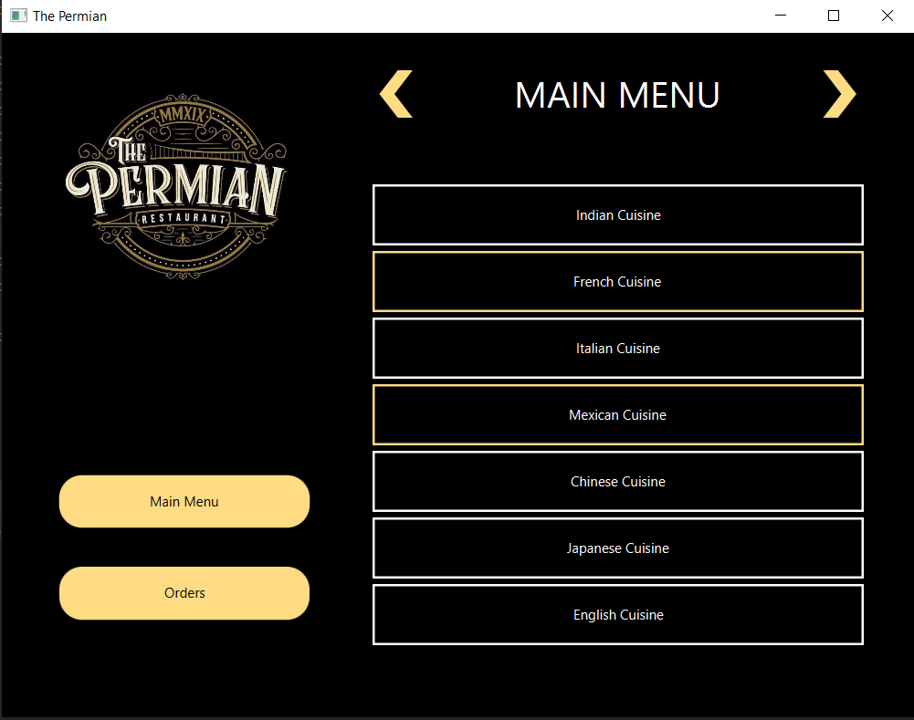
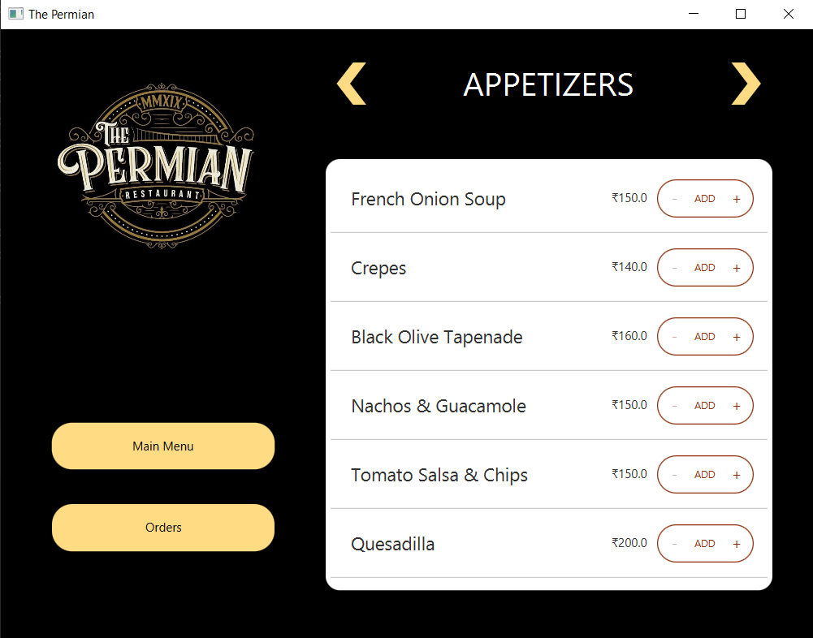

# The Permian
The Permian is a standalone GUI application developed using JavaFX to implement a digital meal ordering system that customizes menus based on the user's choice of cuisine.
The application implements MVC architecture for agile development.

## Project Snapshots

 

    

    

    

    

    

    

## Instillation and Setup
This tutorial uses [IntelliJ IDEA](https://www.jetbrains.com/idea/) and Java SE 16.

### Setting up JDK

#### Windows

1. Download [Java SE](http://www.oracle.com/technetwork/java/javase/downloads/index.html) website and click on JDK download button, this will take you to next page.
2. Under *Java SE Development Kit*, read and accept the licence. Once accepted, download JDK for *Windows X x64* and follow the instructions on the screen.

### Setting up Scene Builder 2.0

1. Download [JavaFX Scene Builder 2.0](http://www.oracle.com/technetwork/java/javase/downloads/javafxscenebuilder-1x-archive-2199384.html) for Windows.
2. Open the setup file and follow the onscreen instructions
3. That's it!

### Setting up IntelliJ IDEA

1. Download the [installer.exe](https://www.jetbrains.com/idea/download/#section=windows) from the Toolbox App web page.
2. Run the installer and follow the wizard steps.
